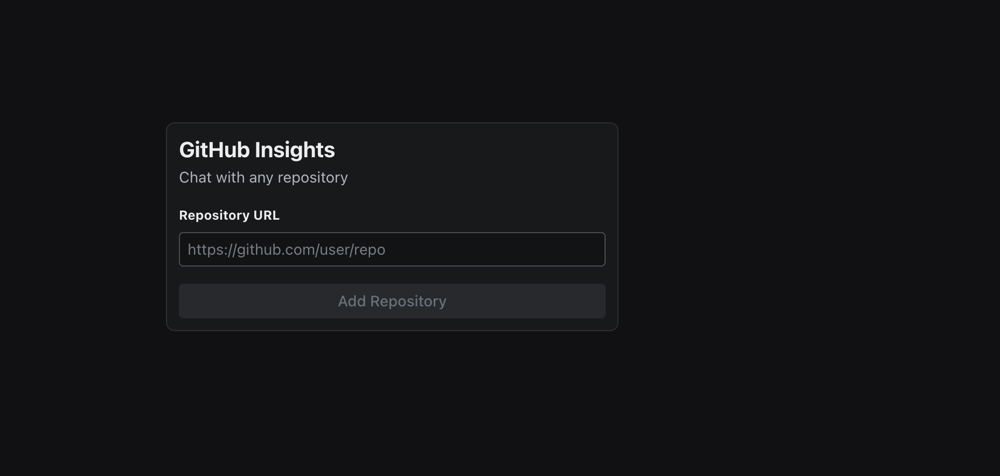
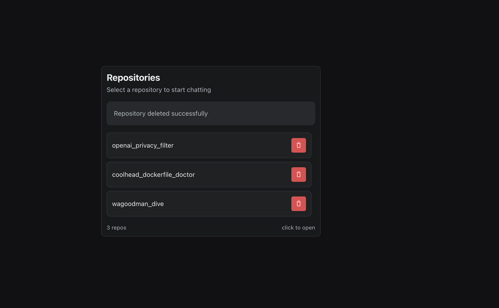
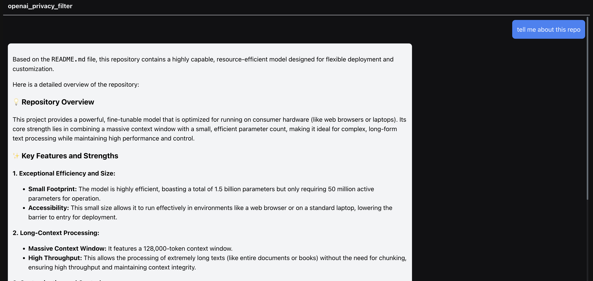

# 🔍 GitHub RAG

> **Retrieval-Augmented Generation for GitHub Repositories** — Ask natural language questions about any public GitHub repo and get intelligent, context-aware answers.

---

## ✨ What is GitHub RAG?

GitHub RAG lets you point at any public GitHub repository and start asking questions about it. It clones the repo, chunks and embeds the source files into a vector database (Qdrant), and uses an LLM (Ollama or Groq) to answer your queries with relevant code snippets as context.

**Example use-cases:**
- *"How does the error-handling work in this library?"*
- *"Where is the authentication logic defined?"*
- *"What does the `parse` function do?"*

---

## 🏗️ Architecture

```
┌─────────────────────────────────────────────────────┐
│                   React Frontend                    │
│           (Radix UI + Tailwind CSS)                 │
└────────────────────┬────────────────────────────────┘
                     │  REST API
┌────────────────────▼────────────────────────────────┐
│               FastAPI Backend                       │
│                                                     │
│  ┌──────────────┐   ┌─────────────┐                │
│  │  GitHub Utils│   │  Repo Utils  │                │
│  │  (clone/fetch)│  │  (chunking)  │               │
│  └──────┬───────┘   └──────┬──────┘                │
│         └────────┬─────────┘                        │
│          ┌───────▼──────┐                           │
│          │  LLM Handler  │                          │
│          │ Ollama / Groq │                          │
│          └───────┬──────┘                           │
│                  │                                  │
│    ┌─────────────▼──────────┐  ┌──────────────┐   │
│    │     Qdrant (vectors)    │  │  Redis Cache  │  │
│    └────────────────────────┘  └──────────────┘   │
└─────────────────────────────────────────────────────┘
```

---

## 📸 Screenshots

### Home Page


### Repository Page


### Chat Page


---

## 🛠️ Tech Stack

| Layer | Technology |
|---|---|
| **Frontend** | React + TypeScript, Radix UI, Tailwind CSS |
| **Backend** | FastAPI (Python) |
| **LLM Providers** | Ollama (local), Groq (cloud) |
| **Embeddings** | Ollama Embeddings |
| **Vector DB** | Qdrant |
| **Cache / Config** | Redis |
| **Package Manager** | `uv` (Python), `npm` (Node) |

---

## 🚀 Getting Started

### Prerequisites

- Python 3.11+
- Node.js 18+
- [Qdrant](https://qdrant.tech/documentation/quickstart/) running locally or via Docker
- [Redis](https://redis.io/docs/getting-started/) running locally
- [Ollama](https://ollama.com/) **or** a [Groq API key](https://console.groq.com/)

### 1. Clone the Repository

```bash
git clone https://github.com/your-username/github_rag.git
cd github_rag
```

### 2. Configure Environment Variables

Copy the example and fill in your values:

```bash
cp .env .env.local
```

```env
QDRANT_URL=http://localhost:6333
REPO_BASE=/tmp/repos          # local path where repos are cloned
REDIS_HOST=localhost
REDIS_PORT=6379
```

### 3. Install Python Dependencies

```bash
# Using uv (recommended)
uv sync

# Or using pip
pip install -r requirements.txt
```

### 4. Install Frontend Dependencies

```bash
npm install
```

### 5. Start Infrastructure (Docker)

```bash
# Qdrant
docker run -p 6333:6333 qdrant/qdrant

# Redis
docker run -p 6379:6379 redis
```

### 6. Configure LLM Provider via Redis

Set your LLM provider settings in Redis. For **Ollama**:

```bash
redis-cli SET llm_provider ollama
redis-cli SET ollama_model llama3
redis-cli SET ollama_base_url http://localhost:11434
redis-cli SET ollama_embedding_model nomic-embed-text
```

For **Groq**:

```bash
redis-cli SET llm_provider groq
redis-cli SET groq_model llama3-8b-8192
redis-cli SET groq_api_key <your-groq-api-key>
redis-cli SET groq_embedding_model nomic-embed-text   # still served via Ollama
```

### 7. Run the Backend

```bash
uv run uvicorn router.app:app --reload --port 8000
```

## 📡 API Reference

All routes are prefixed with `/api/v1`.

### Repository Endpoints

| Method | Endpoint | Description |
|---|---|---|
| `GET` | `/repo/get_all_repos` | List all indexed repositories |
| `GET` | `/repo/{reponame}` | Check if a repo is indexed |
| `POST` | `/repo/add` | Add & index a new repository |
| `POST` | `/repo/{reponame}/query` | Query a repository |

#### Add a Repository

```http
POST /api/v1/repo/add
Content-Type: application/json

{
  "repo_url": "https://github.com/BurntSushi/ripgrep"
}
```

#### Query a Repository

```http
POST /api/v1/repo/{reponame}/query
Content-Type: application/json

{
  "query": "How does the file type detection work?"
}
```


## 📁 Project Structure

```
github_rag/
├── main.py                # FastAPI app entry point & CLI mode
├── config/                # App configuration (LLM provider, etc.)
├── llm/
│   ├── base.py            # Abstract LLM base class
│   ├── groq_handler.py    # Groq LLM integration
│   └── ollama_handler.py  # Ollama LLM integration
├── models/                # Pydantic request/response models
├── qdrantutils/           # Qdrant vector DB client wrapper
├── redis_utils/           # Redis client wrapper
├── repoutils/             # Repo data chunking & preparation
├── router/
│   └── repo_routes.py     # FastAPI route definitions
├── utils/
│   └── github_utils.py    # GitHub repo cloning & traversal
└── frontend/
    └── src/
        └── pages/
            └── Home.tsx   # Main React UI page
```

---

## 🔄 How It Works

1. **Ingest** — Paste a GitHub URL into the UI (or CLI). The app clones the repo, walks the file tree, and chunks source files.
2. **Embed** — Each chunk is converted to a vector embedding using Ollama and stored in a Qdrant collection named after the repo (`owner_reponame`).
3. **Query** — Ask a natural language question. The top-5 most relevant chunks are retrieved from Qdrant and passed to the LLM as context.
4. **Answer** — The LLM generates a grounded response using the retrieved code as context.

---

